# Spark-IoT-Analysis
This repository contains the implementation of a Spark application designed to analyze IoT data samples. It includes code for loading data into HDFS, analyzing it using Spark Shell and Java, and instructions on setting up Spark, compiling, and running the application with Maven and spark-submit.

## 任务说明

在本地机器上安装和部署Spark，利用Spark Shell和Java编写程序，对IOT设备收集的样本数据进行数据统计分析。首先，使用Hadoop Shell命令将数据加载至本地HDFS，然后在Spark平台上进行操作。使用Spark Shell和Java语言进行编程，统计数据文件的行数，并使用Maven编译打包Java应用程序，通过spark-submit运行程序。

## 具体代码实现

### 0 Hadoop加载数据文件

下载数据文件，并传至虚拟机：

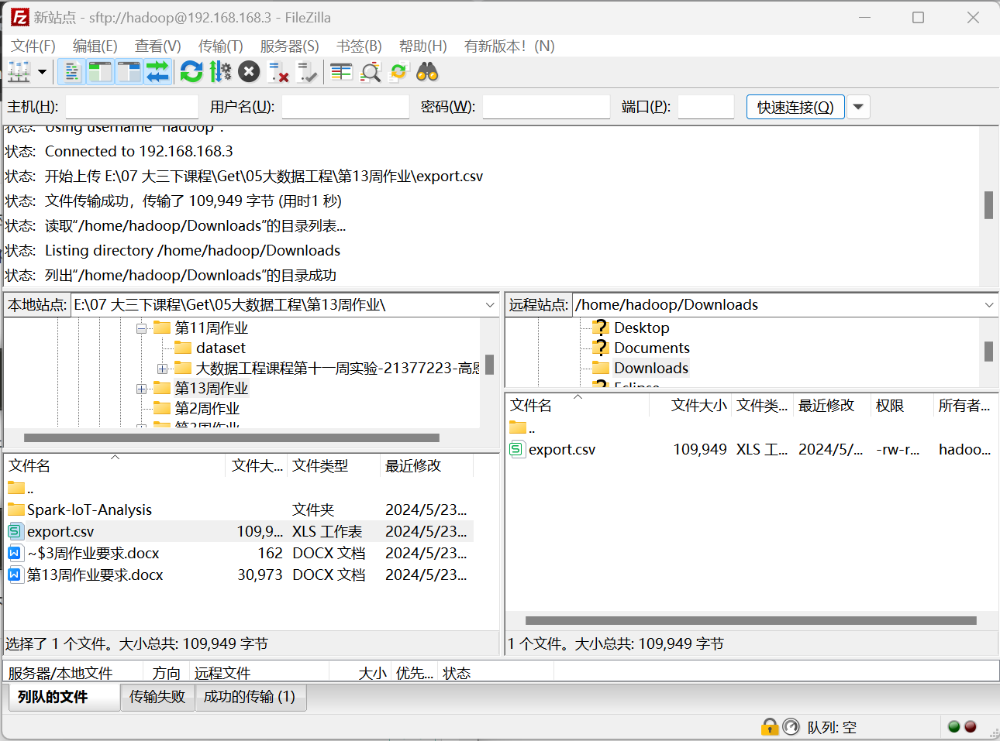

启动hadoop服务：

```shell
cd /usr/local/hadoop
./sbin/start-dfs.sh #启动hadoop
jps
```

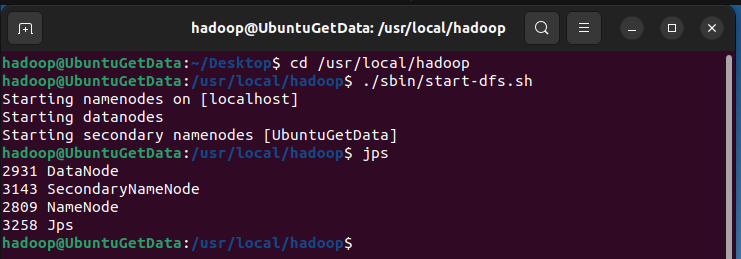

创建工作目录，并将数据文件传入工作目录中：

```shell
./bin/hdfs dfs -ls /
./bin/hdfs dfs -mkdir /user/spark
./bin/hdfs dfs -put /home/hadoop/Downloads/export.csv  /user/spark
```

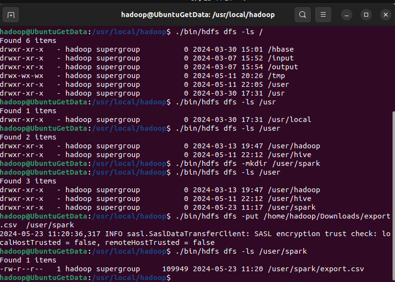

传输完成！

### 1 安装部署Spark

首先需要下载Spark安装文件。访问[Spark官方下载地址](http://spark.apache.org/downloads.html)，按照如下图下载：

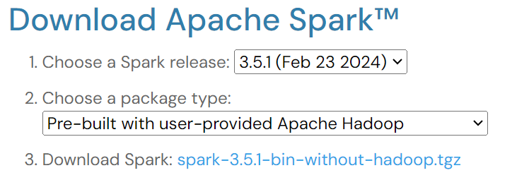

安装Spark（Local模式），执行以下命令进行解压安装：

```bash
sudo tar -zxf ~/Downloads/spark-3.5.1-bin-without-hadoop.tgz -C /usr/local/
cd /usr/local
sudo mv ./spark-3.5.1-bin-without-hadoop/ ./spark
sudo chown -R hadoop:hadoop ./spark          
```

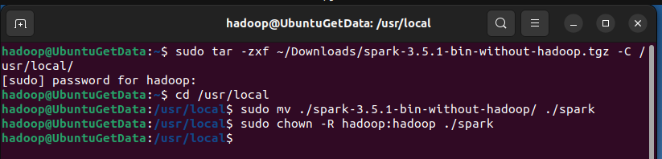

安装后，还需要修改Spark的配置文件spark-env.sh

```bash
cd /usr/local/spark
cp ./conf/spark-env.sh.template ./conf/spark-env.sh
```

编辑spark-env.sh文件(vim ./conf/spark-env.sh)，在第一行添加以下配置信息:

```shell
export SPARK_DIST_CLASSPATH=$(/usr/local/hadoop/bin/hadoop classpath)
```

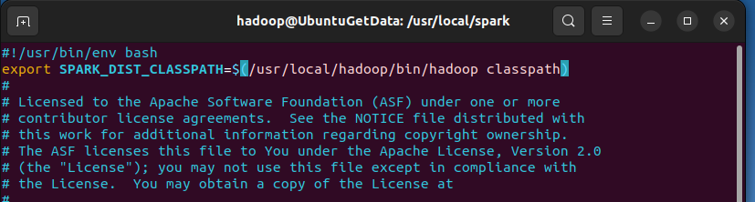

配置完成后就可以直接使用，不需要像Hadoop运行启动命令。

通过运行Spark自带的示例，验证Spark是否安装成功。

```bash
cd /usr/local/spark
bin/run-example SparkPi
```

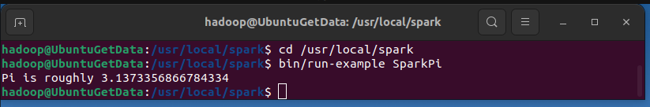

执行时会输出非常多的运行信息，输出结果不容易找到，可以通过 grep 命令进行过滤（命令中的 2>&1 可以将所有的信息都输出到 stdout 中，否则由于输出日志的性质，还是会输出到屏幕中）:

```bash
cd /usr/local/spark
bin/run-example SparkPi 2>&1 | grep "Pi is"
```

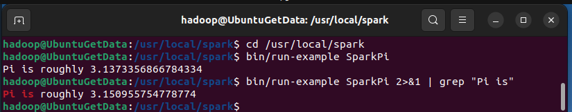

### 2 Spark Shell统计文件行数

首先启动spark shell

```shell
cd /usr/local/spark
bin/spark-shell
```

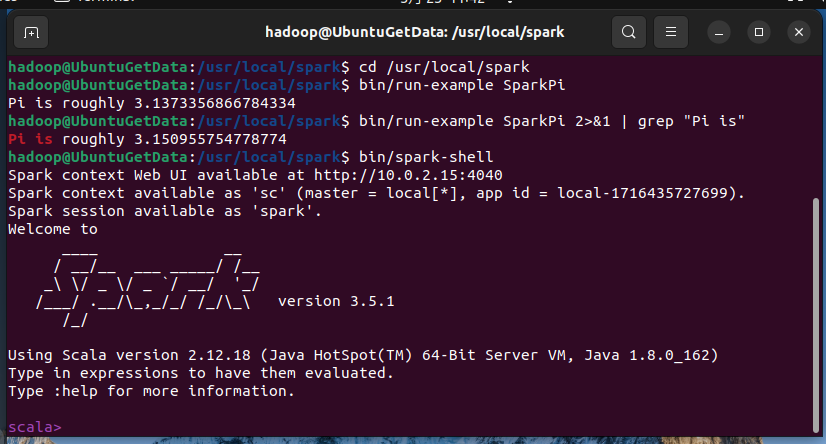

用spark shell读取数据文件并统计行数：

```scala
val textFile = sc.textFile("hdfs://localhost:9000/user/spark/export.csv")
val lineCount = textFile.count()
println(s"Total number of lines in the file: $lineCount")
```

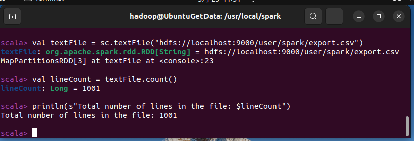

统计成功！共有1001行！

### 3 maven打包执行Java

首先安装maven：

访问[apache-maven的下载地址](https://maven.apache.org/download.cgi#Files)，直接点击下载，选择[apache-maven-3.9.6-bin.zip](https://dlcdn.apache.org/maven/maven-3/3.9.6/binaries/apache-maven-3.9.6-bin.zip)即可。

这里选择安装在/usr/local/maven目录中：

```bash
sudo unzip ~/Downloads/apache-maven-3.9.6-bin.zip -d /usr/local
cd /usr/local
sudo mv apache-maven-3.9.6/ ./maven
sudo chown -R hadoop ./maven
```

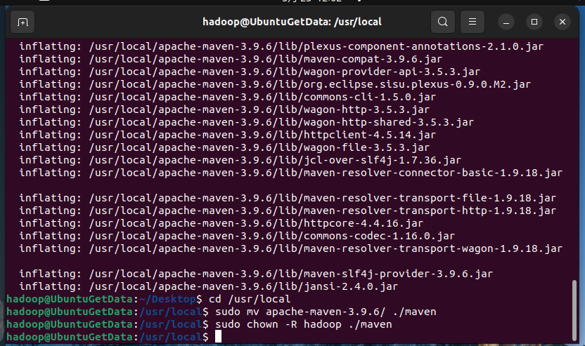

在终端执行如下命令创建一个文件夹`sparkapp`作为应用程序根目录

```shell
cd ~ 
mkdir -p ./sparkapp/src/main/java
```

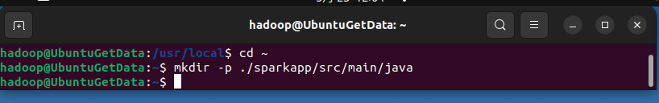

在 `./sparkapp/src/main/java `下建立一个名为 `CountLines.java` 的文件（`vim ./sparkapp/src/main/java/CountLines.java`），添加代码如下，即读取hadoop的文件：

```java
/*** SimpleApp.java ***/
import org.apache.spark.api.java.*;
import org.apache.spark.SparkConf;

public class CountLines {
    public static void main(String[] args) {
        // 指定文件位于 HDFS 上的路径
        String hdfsFile = "hdfs://localhost:9000/user/spark/export.csv"; 

        // 配置 Spark
        SparkConf conf = new SparkConf().setMaster("local").setAppName("File Line Counter");

        // 初始化 JavaSparkContext
        JavaSparkContext sc = new JavaSparkContext(conf);

        // 从 HDFS 读取文件，创建一个 JavaRDD
        JavaRDD<String> fileData = sc.textFile(hdfsFile);

        // 计算文件的行数
        long lineCount = fileData.count();

        // 输出行数
        System.out.println("Total number of lines in the file: " + lineCount);

        // 关闭 SparkContext
        sc.close();
    }
}
```

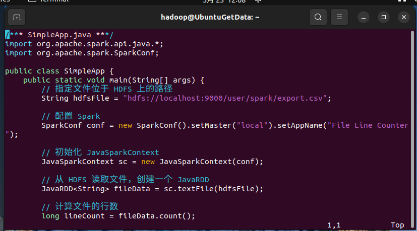

通过Maven进行编译打包。在`./sparkapp`目录中新建文件`pom.xml`，命令如下：

```shell
cd ~/sparkapp
vim pom.xml
```

在pom.xml文件中添加内容如下，声明该独立应用程序的信息以及与Spark的依赖关系：

```xml
<project>
    <groupId>cn.edu.xmu</groupId>
    <artifactId>simple-project</artifactId>
    <modelVersion>4.0.0</modelVersion>
    <name>Simple Project</name>
    <packaging>jar</packaging>
    <version>1.0</version>
    <repositories>
        <repository>
            <id>jboss</id>
            <name>JBoss Repository</name>
            <url>http://repository.jboss.com/maven2/</url>
        </repository>
    </repositories>
    <dependencies>
        <dependency> <!-- Spark dependency -->
            <groupId>org.apache.spark</groupId>
            <artifactId>spark-core_2.11</artifactId>
            <version>2.4.0</version>
        </dependency>
    </dependencies>
</project>  
```

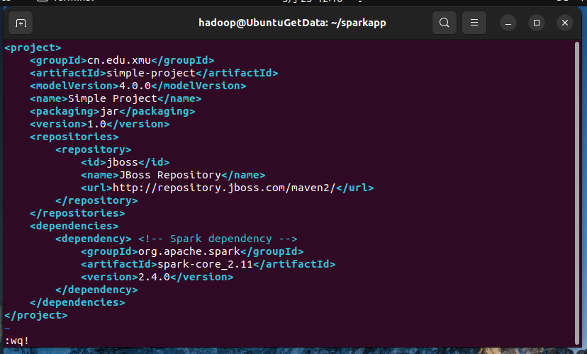

为了保证maven能够正常运行，先执行如下命令检查整个应用程序的文件结构:

```shell
cd ~/sparkapp
find .
```

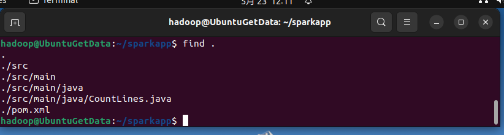

通过如下代码将这整个应用程序打包成Jar:

```shell
cd ~/sparkapp
/usr/local/maven/bin/mvn package
```

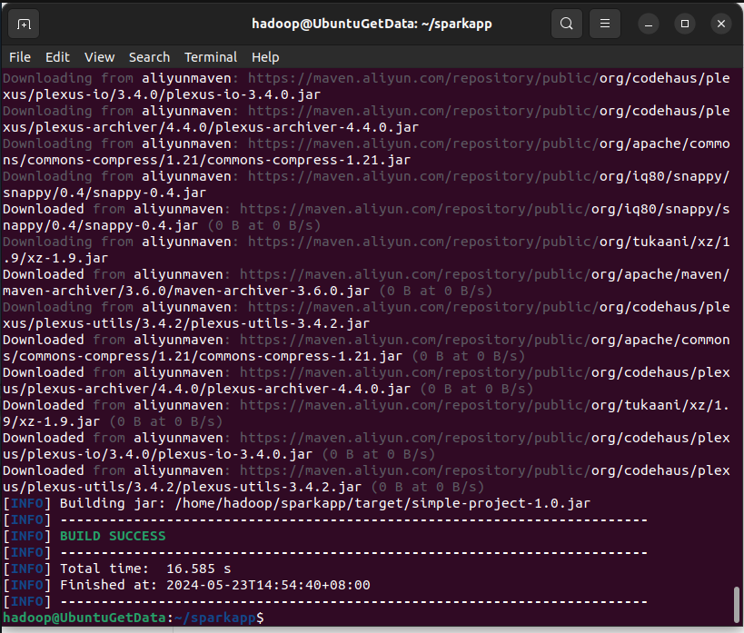

编译打包成功！

通过将生成的jar包通过spark-submit提交到Spark中运行，如下命令：

```bash
/usr/local/spark/bin/spark-submit --class "CountLines" ~/sparkapp/target/simple-project-1.0.jar
```

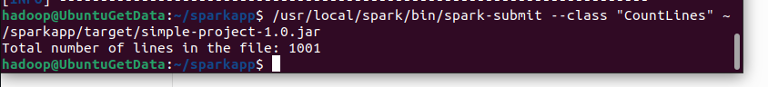

执行成功！
